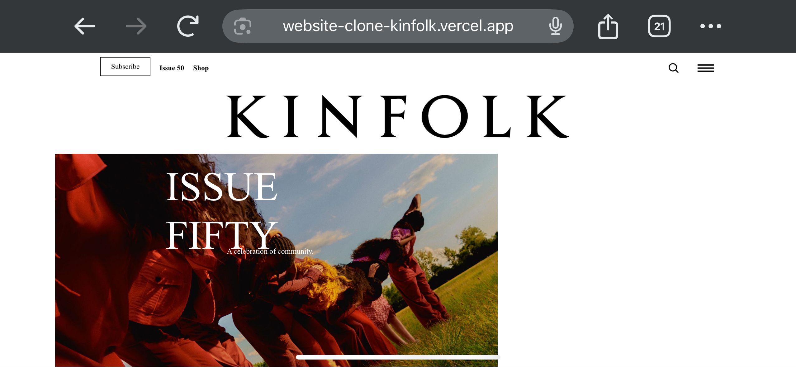
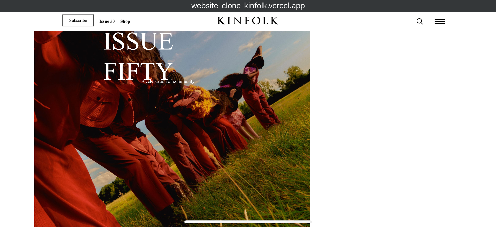
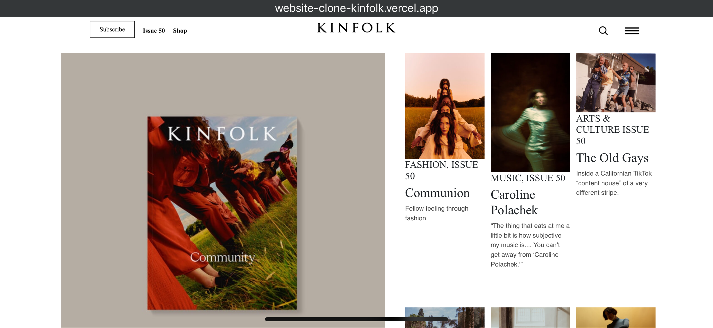
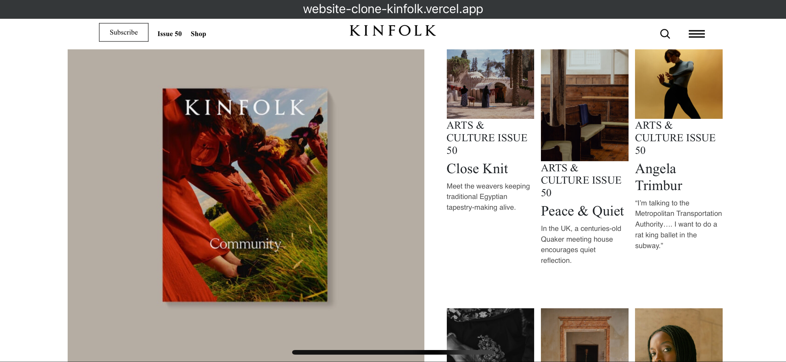
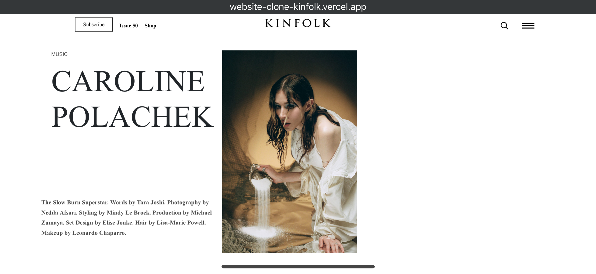
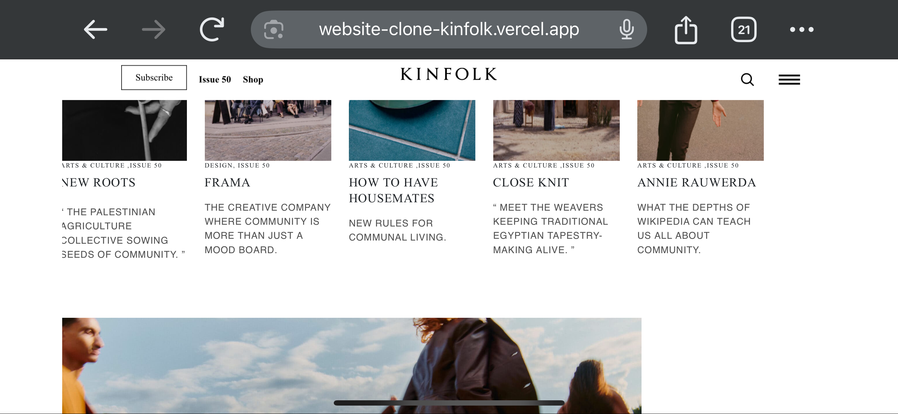

# 🎨 Kinfolk Website Clone (Issue Fifty)

A pixel-perfect clone of the Kinfolk Issue Fifty homepage built using HTML and CSS. Designed with careful attention to layout, typography, and responsiveness to match the original print aesthetic.

## 🌐 Live Demo  
[https://website-clone-kinfolk.vercel.app](https://website-clone-kinfolk.vercel.app)

[](https://website-clone-kinfolk.vercel.app)

---

## 💡 Features
- Fully responsive layout
- Clean minimalist design
- CSS Flexbox and Grid layout
- Typography inspired by Kinfolk branding

---

## 🛠️ Tech Stack
- HTML5
- CSS3
- Hosted on Vercel

---

## 🚀 Getting Started

```bash
git clone https://github.com/0535MANIDEEP/Website_Clone_Kinfolk.git
cd Website_Clone_Kinfolk
open index.html
```

---

## 📁 Folder Structure

```
Website_Clone_Kinfolk/
├── index.html
├── style.css
├── /images
├── /screenshots
```

---

## 📸 Screenshots

  
  
  
  
  


---

## 👤 Author

**Manideep Daram**  
📧 manideepdaram@gmail.com  
🔗 [GitHub](https://github.com/0535MANIDEEP)  
🔗 [LinkedIn](https://linkedin.com/in/manideep-daram)
